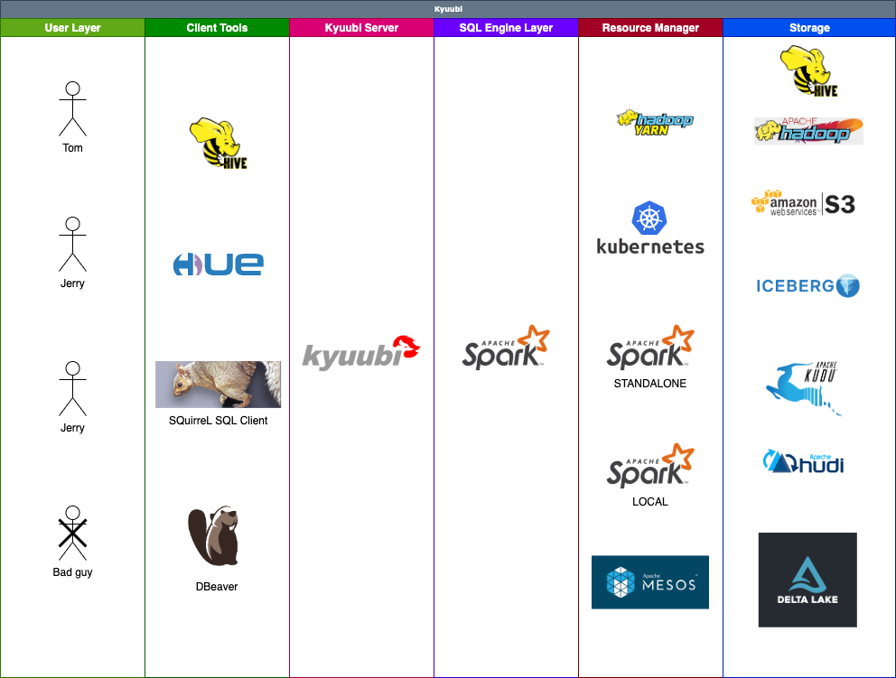

# Kyuubi™

Kyuubi™ is a unified multi-tenant JDBC interface for large-scale data processing, built on top of [Apache Spark™](http://spark.apache.org/).

In general, the complete ecosystem of Kyuubi falls into the hierarchies shown in the above figure, with each layer loosely coupled to the other.

For example,

You can use Kyuubi, Spark and [Apache Iceberg](https://iceberg.apache.org/) to build and manage Data Lake with pure SQL.

Kyuubi provides the following features:

## Multi-tenancy

Kyuubi supports the end-to-end multi-tenancy,
and this is why we want to create this project despite that the Spark [Thrift JDBC/ODBC server](http://spark.apache.org/docs/latest/sql-distributed-sql-engine.html#running-the-thrift-jdbcodbc-server) already exists.

1. Supports multi-client concurrency and authentication
2. Supports one Spark application per account(SPA).
3. Supports QUEUE/NAMESPACE Access Control Lists (ACL)
4. Supports metadata & data Access Control Lists

Users who have valid accounts could use all kinds of client tools, e.g.
Hive Beeline, [HUE](https://gethue.com/), [DBeaver](https://dbeaver.io/),
[SQuirreL SQL Client](http://squirrel-sql.sourceforge.net/), etc,
to operate with Kyuubi server concurrently.

The SPA policy makes sure 1) a user account can only get computing resource with managed ACLs, e.g.
[Queue Access Control Lists](https://hadoop.apache.org/docs/current/hadoop-yarn/hadoop-yarn-site/FairScheduler.html#Queue_Access_Control_Lists),
from cluster managers, e.g.
[Apache Hadoop YARN](https://hadoop.apache.org/docs/current/hadoop-yarn/hadoop-yarn-site/YARN.html),
[Kubernetes (K8s)](https://kubernetes.io/) to create the Spark application;
2) a user account can only access data and metadata from a storage system, e.g.
[Apache Hadoop HDFS](https://hadoop.apache.org/docs/current/hadoop-project-dist/hadoop-hdfs/HdfsDesign.html),
with permissions.

## Ease of Use

You only need to be familiar with Structured Query Language (SQL) and Java Database Connectivity (JDBC) to handle massive data.
It helps you focus on the design and implementation of your business system.

- SQL is the standard language for accessing relational databases, and very popular in big data eco too.
  It turns out that everybody knows SQL.
- JDBC provides a standard API for tool/database developers and makes it possible to write database applications using a pure Java API.
- There are plenty of free or commercial JDBC tools out there.

## Run Anywhere

Kyuubi can submit Spark applications to all supported cluster managers, including YARN, Mesos, Kubernetes, Standalone, and local.

The SPA policy also make it possible for you to launch different applications against different cluster managers.

## High Performance

Kyuubi is built on the Apache Spark, a lightning-fast unified analytics engine.

 - **Concurrent execution**: multiple Spark applications work together
 - **Quick response**: long-running Spark applications without startup cost
 - **Optimal execution plan**: fully supports Spark SQL Catalyst Optimizer,

## Authentication & Authorization

## High Availability