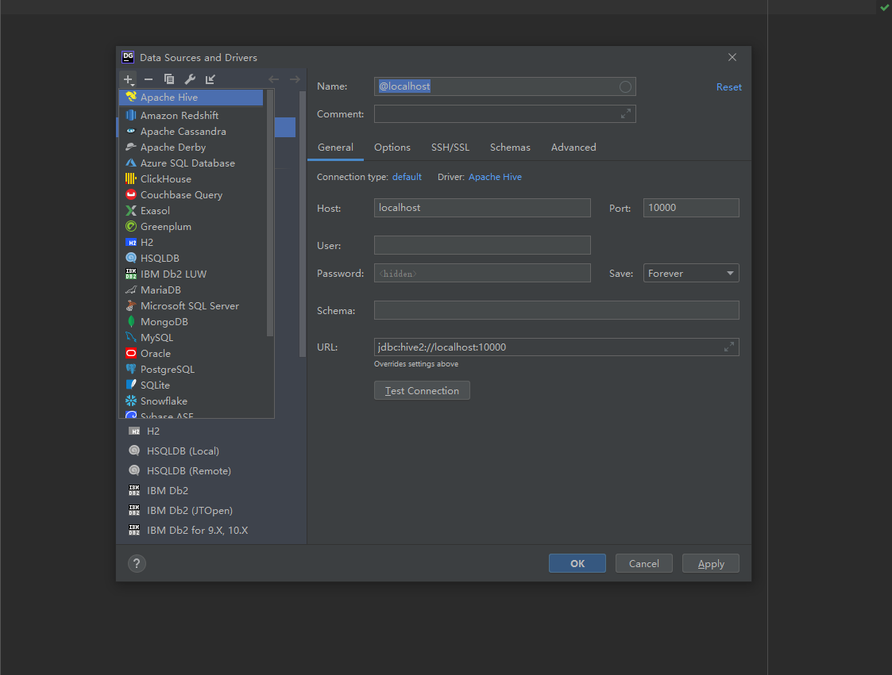
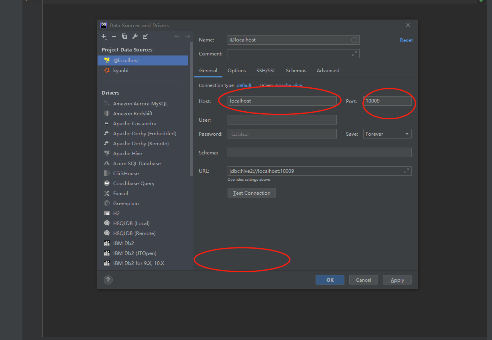
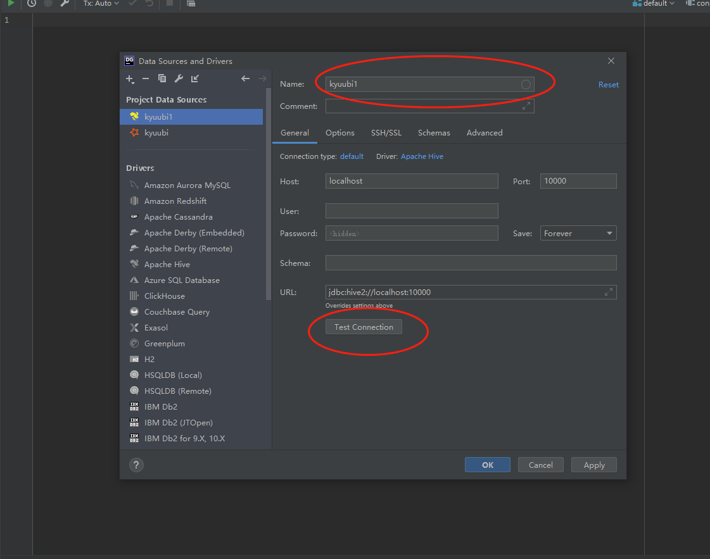
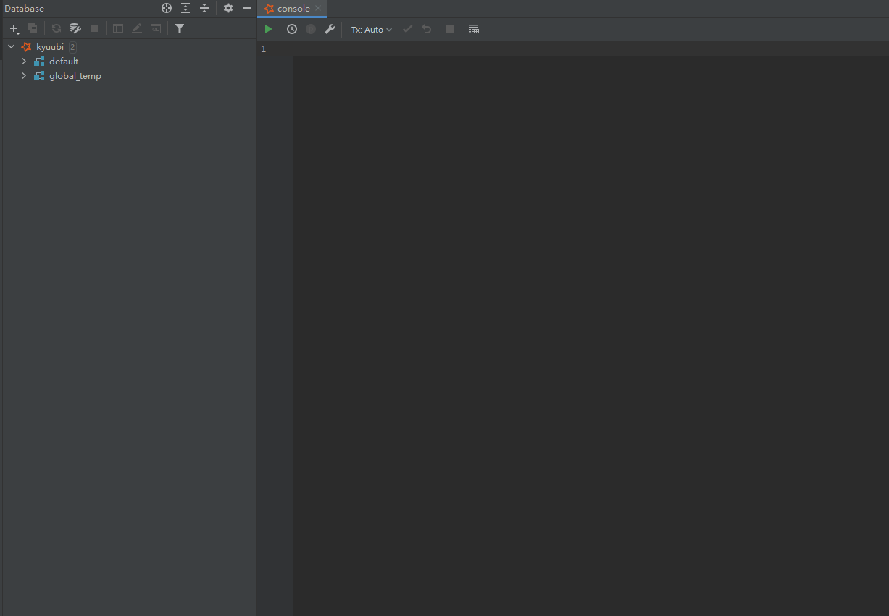

# Getting Started With Kyuubi and DataGrip
## What is DataGrip
DataGrip is a multi-engine database environment released by JetBrains, supporting MySQL and PostgreSQL, Microsoft SQL Server and Oracle, Sybase, DB2, SQLite, HyperSQL, Apache Derby, and H2.

[About DataGrip](https://www.jetbrains.com/datagrip/)
## Preparation
### Get DataGrip And Install
Please go to [Download DataGrip](https://www.jetbrains.com/datagrip/download) to get and install an appropriate version for yourself.
### Get Kyuubi Started
[Get kyuubi server started](https://kyuubi.readthedocs.io/en/latest/quick_start/quick_start.html) before you try DataGrip with kyuubi.

For debugging purpose, you can use ```tail -f``` or ```tailf``` to track the server log.
## Configurations
### Start DataGrip
After you install DataGrip, just launch it.
### Select Database
Substantially, this step is to choose a JDBC Driver type to use later. We can choose Apache Hive to set up a driver for Kyuubi.


### Datasource Driver
You should first download the missing driver files. Just click on the link below, DataGrip will download and install those. 


### Generic JDBC Connection Settings
After install drivers, you should configure the right host and port which you can find in kyuubi server log. By default, we use ```localhost``` and ```10009``` to configure.

Of curse, you can fill other configs.

After generic configs, you can use test connection to test.


## Interacting With Kyuubi Server
Now, you can interact with Kyuubi server.

The left side of the photo is the table, and the right side of the photo is the console.

You can interact through the visual interface or code.


## At The End
There are many other amazing features in both Kyuubi and DataGrip and here is just the tip of the iceberg. The rest is for you to discover.