<div align=center>


</div>

# Getting Started With Kyuubi and DBeaver

## What is DBeaver

[DBeaver](https://dbeaver.io/) is a free multi-platform database tool for developers, database administrators, analysts and all people who need to work with databases.
Supports all popular databases as well as our Kyuubi.

Get to know more [About DBeaver](https://github.com/dbeaver/dbeaver/wiki).

## Preparation

### Get DBeaver and Install

Please go to [Download DBeaver](https://dbeaver.io/download/) page to get and install an appropriate release version for yourself.

### Get Kyuubi Started

[Get the server Started](quick_start.md) first before your try DBeaver with Kyuubi.

```bash
Welcome to
  __  __                           __
 /\ \/\ \                         /\ \      __
 \ \ \/'/'  __  __  __  __  __  __\ \ \____/\_\
  \ \ , <  /\ \/\ \/\ \/\ \/\ \/\ \\ \ '__`\/\ \
   \ \ \\`\\ \ \_\ \ \ \_\ \ \ \_\ \\ \ \L\ \ \ \
    \ \_\ \_\/`____ \ \____/\ \____/ \ \_,__/\ \_\
     \/_/\/_/`/___/> \/___/  \/___/   \/___/  \/_/
                /\___/
                \/__/
```

For debugging purpose, you can `tail -f` or `tailf` to track the server log like:

```logtalk
$ tail -f /Users/kentyao/Downloads/kyuubi/kyuubi-1.0.2-bin-spark-3.0.1/logs/kyuubi-kentyao-org.apache.kyuubi.server.KyuubiServer-hulk.local.out
2021-01-16 03:27:35.449 INFO server.NIOServerCnxnFactory: Accepted socket connection from /127.0.0.1:65320
2021-01-16 03:27:35.453 INFO server.ZooKeeperServer: Client attempting to establish new session at /127.0.0.1:65320
2021-01-16 03:27:35.455 INFO persistence.FileTxnLog: Creating new log file: log.1
2021-01-16 03:27:35.491 INFO server.ZooKeeperServer: Established session 0x177078469840000 with negotiated timeout 60000 for client /127.0.0.1:65320
2021-01-16 03:27:35.492 INFO zookeeper.ClientCnxn: Session establishment complete on server 127.0.0.1/127.0.0.1:2181, sessionid = 0x177078469840000, negotiated timeout = 60000
2021-01-16 03:27:35.494 INFO state.ConnectionStateManager: State change: CONNECTED
2021-01-16 03:27:35.495 INFO client.ServiceDiscovery: Zookeeper client connection state changed to: CONNECTED
2021-01-16 03:27:36.516 INFO client.ServiceDiscovery: Created a /kyuubi/serviceUri=localhost:10009;version=1.0.2;sequence=0000000000 on ZooKeeper for KyuubiServer uri: localhost:10009
2021-01-16 03:27:36.516 INFO client.ServiceDiscovery: Service[ServiceDiscovery] is started.
2021-01-16 03:27:36.516 INFO server.KyuubiServer: Service[KyuubiServer] is started.
```

## Configurations
### Start DBeaver

If you have successfully installed DBeaver, just hit the button to launch it.

### Select a database

Substantially, this step is to choose a JDBC Driver type to use later.
We can choose Apache Hive or Apache Spark to set up a driver for Kyuubi, because they are compatible with the same client. 

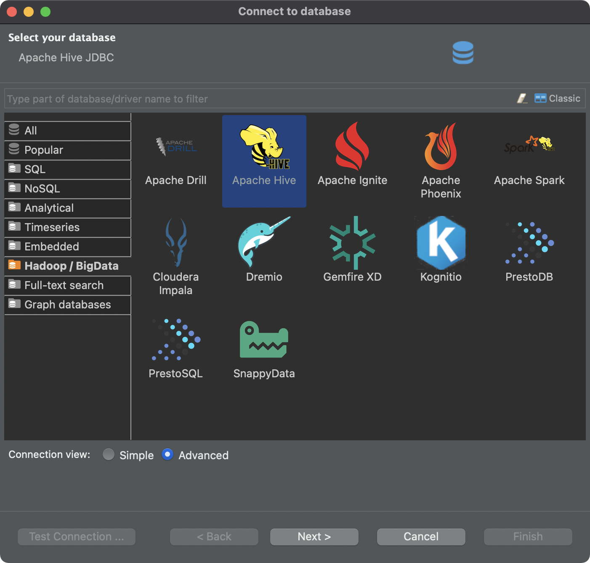
*Tips: zoom up if the pic looks small*

Click next...

### Edit the Driver

We can set libraries that include the `org.apache.hive.jdbc.HiveDriver` and all of its dependencies.

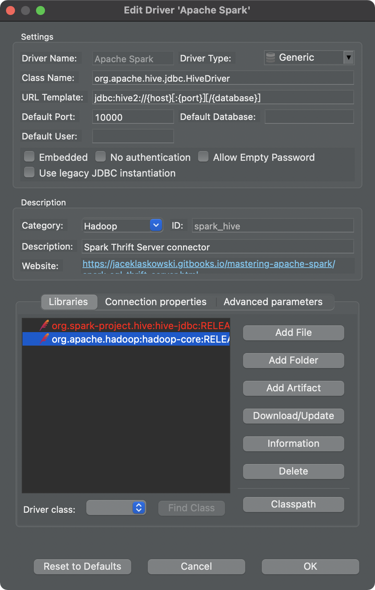
*Tips: zoom up if the pic looks small*

Download/Update it... or,

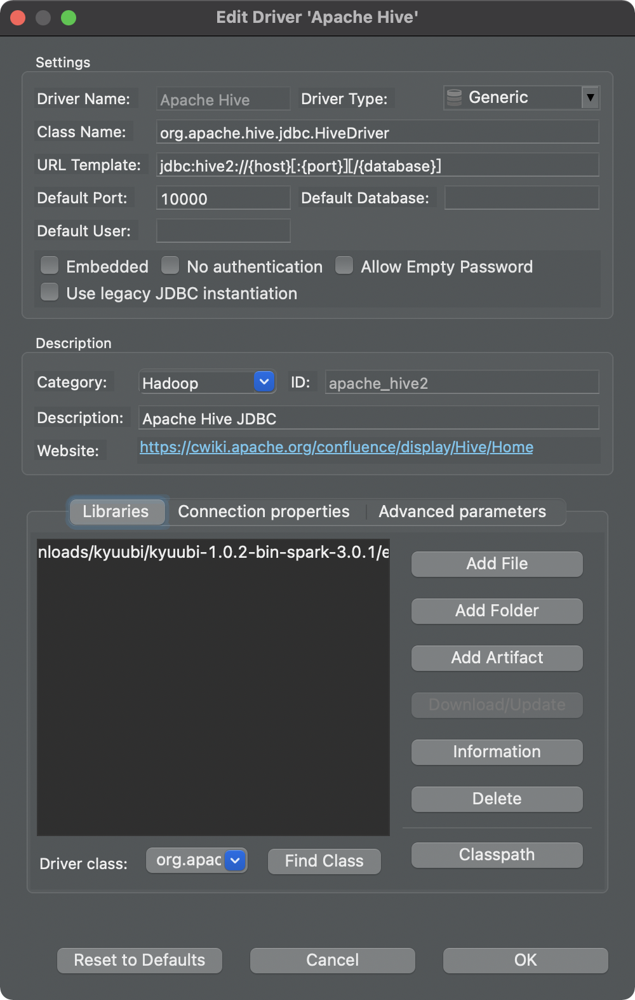
*Tips: zoom up if the pic looks small*

We can configure it by adding a local folder which contains these jars.

### Generic JDBC Connection Settings

To connect to Kyuubi, we should configure the right host and port that starts the server.
By default, Kyuubi starts on port `10009` on your localhost.

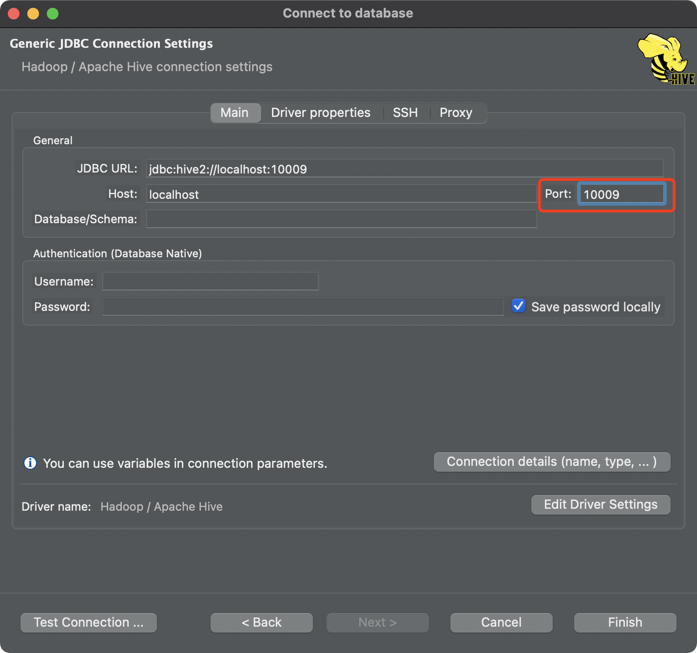
*Tips: zoom up if the pic looks small*

### Other settings

We also can name a recognizable title for this connection.

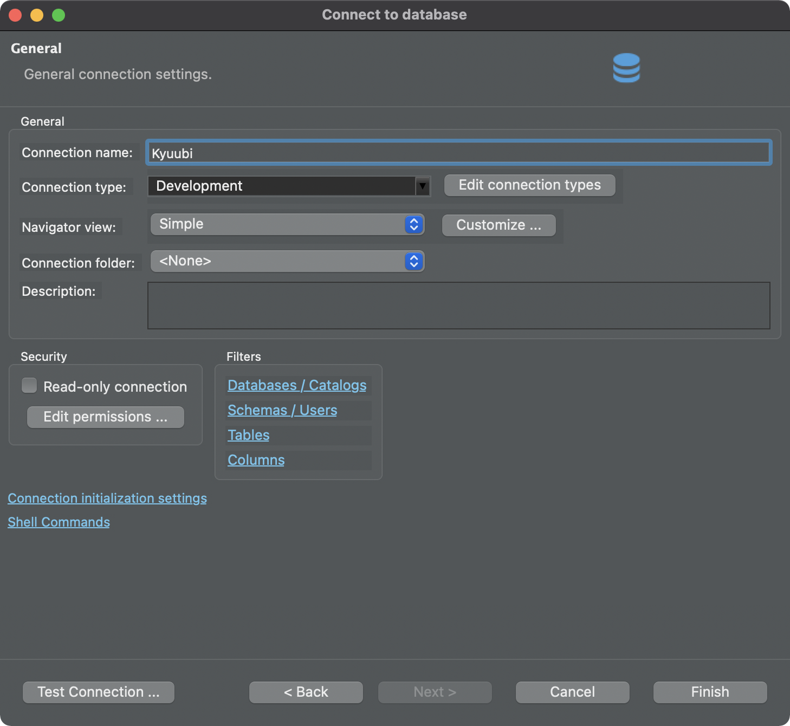
*Tips: zoom up if the pic looks small*

## Interacting With Kyuubi server

### Connections

First, we need to active the connection with Kyuubi server we created in the above steps.

Correspondingly, the server will help us start an engine, and we will be able to see a log like below,

```logtalk
2021-01-16 14:33:56.050 INFO session.KyuubiSessionImpl: Launching SQL engine:
```
Once the connection is set up, we shall be able to see the default catalog, databases(namespaces) as below.


### Operations

Now, we can use the SQL editor to write queries to interact with Kyuubi server through the connection. 

```sql
DESC NAMESPACE DEFAULT;
```
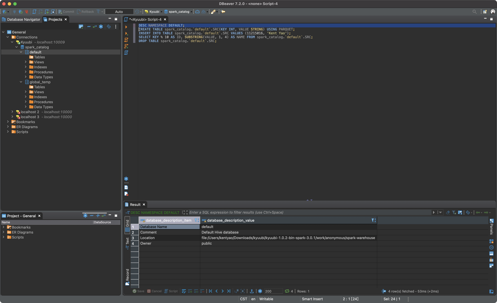

```sql
CREATE TABLE spark_catalog.`default`.SRC(KEY INT, VALUE STRING) USING PARQUET;
INSERT INTO TABLE spark_catalog.`default`.SRC VALUES (11215016, 'Kent Yao');
```
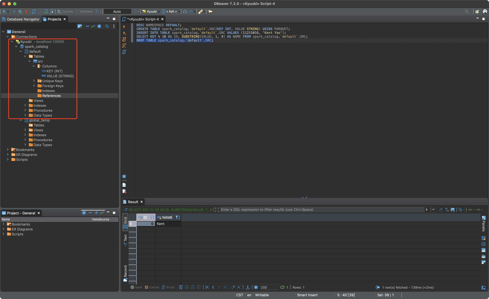
*Tips: zoom up if the pic looks small*

```sql
SELECT KEY % 10 AS ID, SUBSTRING(VALUE, 1, 4) AS NAME FROM spark_catalog.`default`.SRC;
```
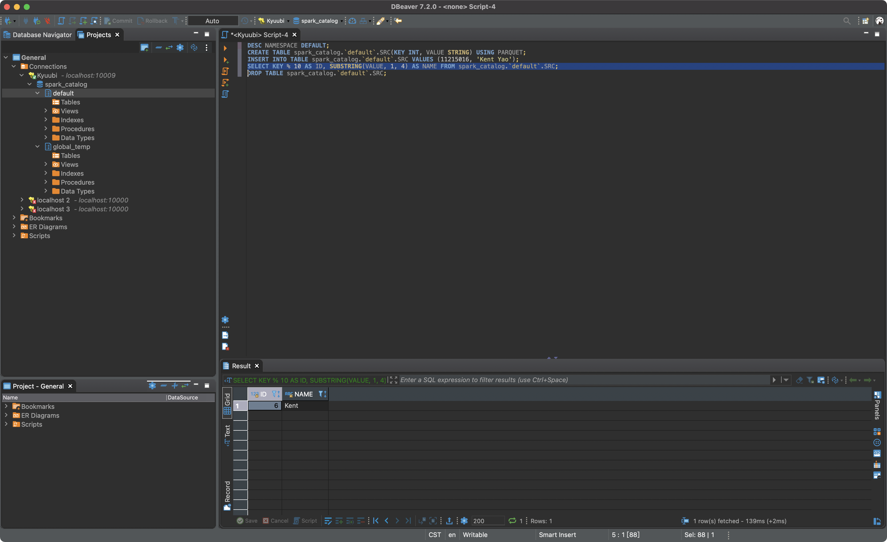
*Tips: zoom up if the pic looks small*

```sql
DROP TABLE spark_catalog.`default`.SRC;
```

## One more case with TPCDS

After we create the TPCDS table in Kyuubi server side, we are able to get all the database objects, including catalogs, databases, tables, and columns e.t.c.

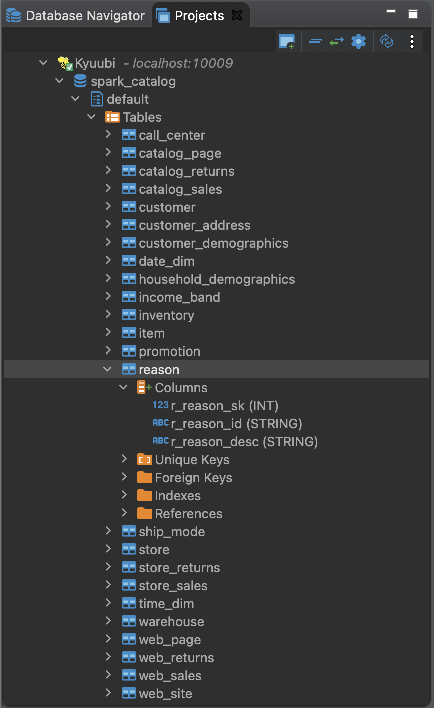
*Tips: zoom up if the pic looks small*

Also, we can use the shortcut key to operating metadata and data, for example.

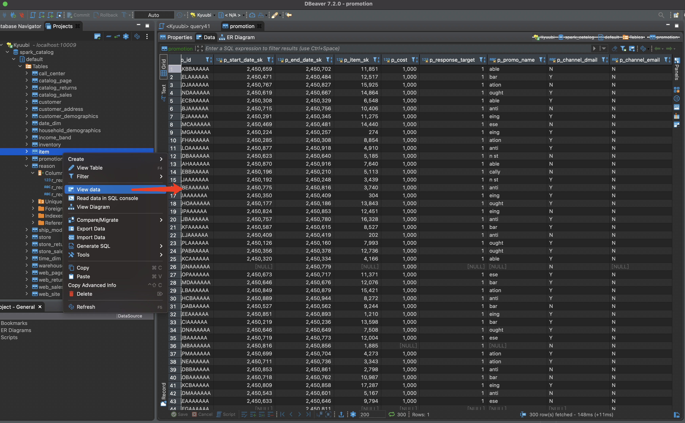
*Tips: zoom up if the pic looks small*

And we can write simple or complex SQL to manipulate data, for example, here is the query 41 generated by TPCDS `dsqgen` tool.

```sql
SELECT DISTINCT (i_product_name)
FROM item i1
WHERE i_manufact_id BETWEEN 738 AND 738 + 40
  AND (SELECT count(*) AS item_cnt
FROM item
WHERE (i_manufact = i1.i_manufact AND
  ((i_category = 'Women' AND
    (i_color = 'powder' OR i_color = 'khaki') AND
    (i_units = 'Ounce' OR i_units = 'Oz') AND
    (i_size = 'medium' OR i_size = 'extra large')
  ) OR
    (i_category = 'Women' AND
      (i_color = 'brown' OR i_color = 'honeydew') AND
      (i_units = 'Bunch' OR i_units = 'Ton') AND
      (i_size = 'N/A' OR i_size = 'small')
    ) OR
    (i_category = 'Men' AND
      (i_color = 'floral' OR i_color = 'deep') AND
      (i_units = 'N/A' OR i_units = 'Dozen') AND
      (i_size = 'petite' OR i_size = 'large')
    ) OR
    (i_category = 'Men' AND
      (i_color = 'light' OR i_color = 'cornflower') AND
      (i_units = 'Box' OR i_units = 'Pound') AND
      (i_size = 'medium' OR i_size = 'extra large')
    ))) OR
  (i_manufact = i1.i_manufact AND
    ((i_category = 'Women' AND
      (i_color = 'midnight' OR i_color = 'snow') AND
      (i_units = 'Pallet' OR i_units = 'Gross') AND
      (i_size = 'medium' OR i_size = 'extra large')
    ) OR
      (i_category = 'Women' AND
        (i_color = 'cyan' OR i_color = 'papaya') AND
        (i_units = 'Cup' OR i_units = 'Dram') AND
        (i_size = 'N/A' OR i_size = 'small')
      ) OR
      (i_category = 'Men' AND
        (i_color = 'orange' OR i_color = 'frosted') AND
        (i_units = 'Each' OR i_units = 'Tbl') AND
        (i_size = 'petite' OR i_size = 'large')
      ) OR
      (i_category = 'Men' AND
        (i_color = 'forest' OR i_color = 'ghost') AND
        (i_units = 'Lb' OR i_units = 'Bundle') AND
        (i_size = 'medium' OR i_size = 'extra large')
      )))) > 0
ORDER BY i_product_name
LIMIT 100
```

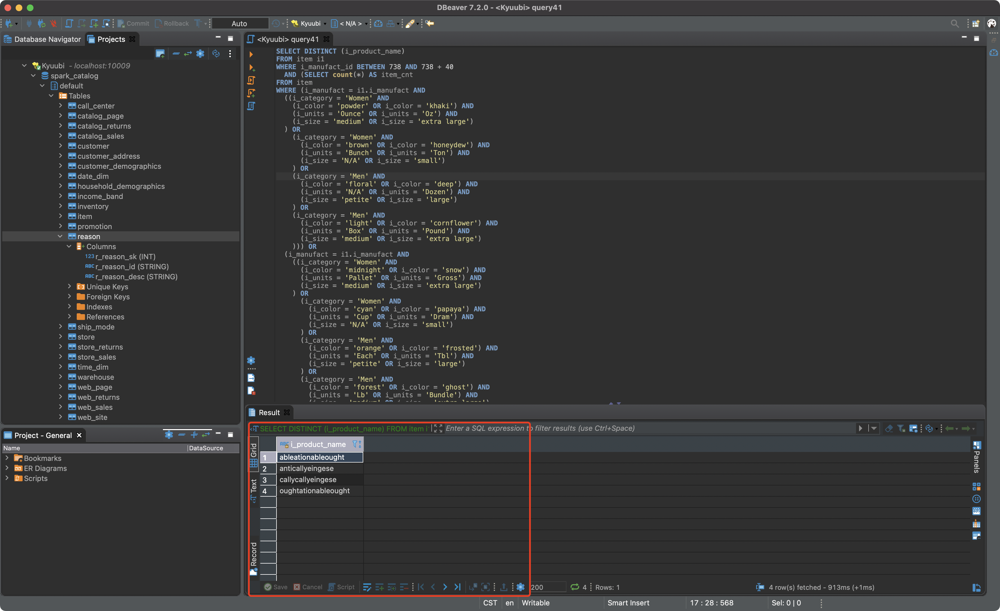
*Tips: zoom up if the pic looks small*

## Epilogue

There are many other amazing features in both Kyuubi and DBeaver and here is just the tip of the iceberg.
The rest is for you to discover.
